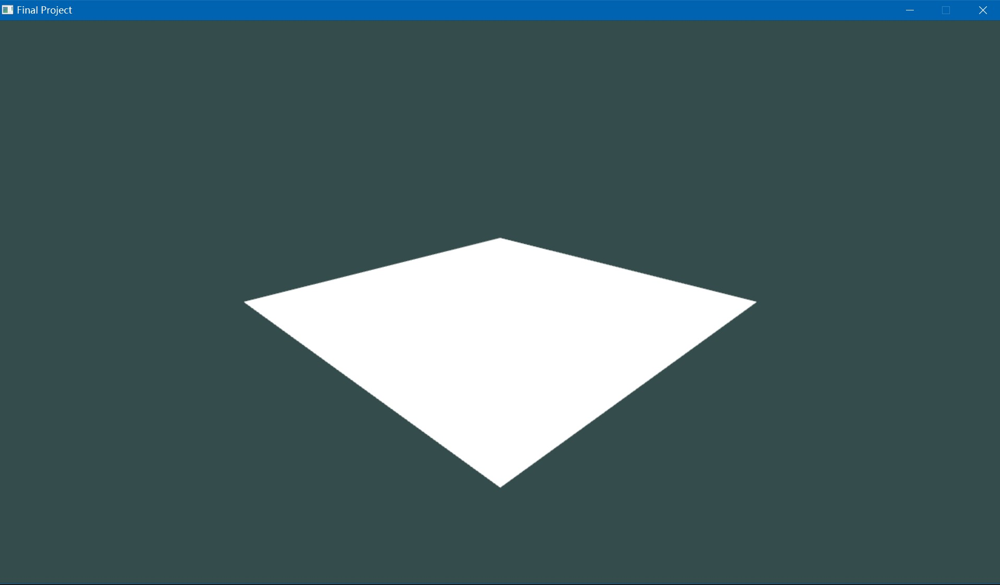
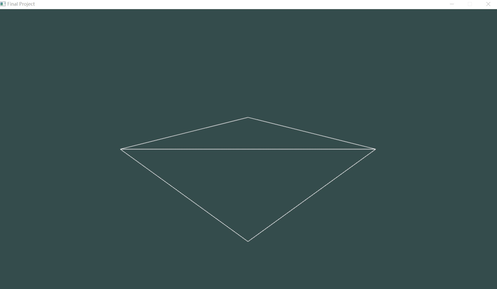
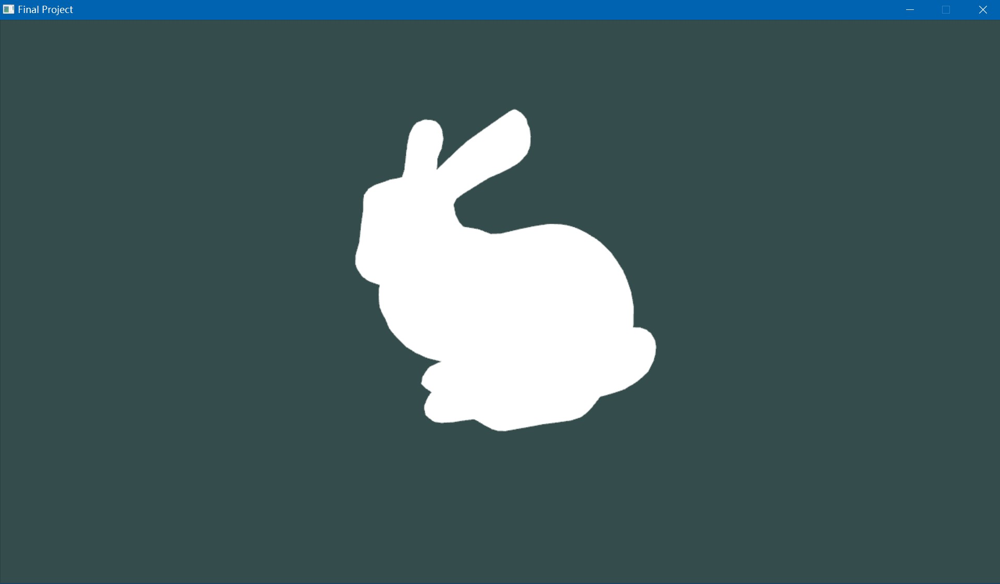
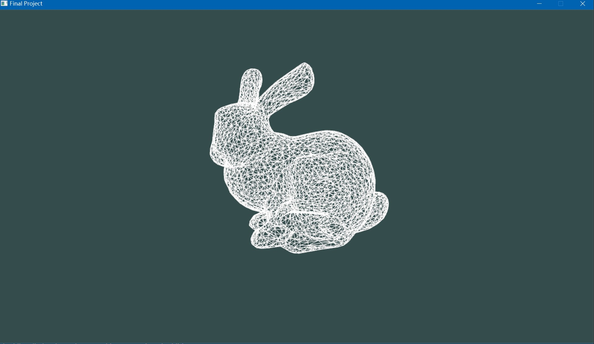
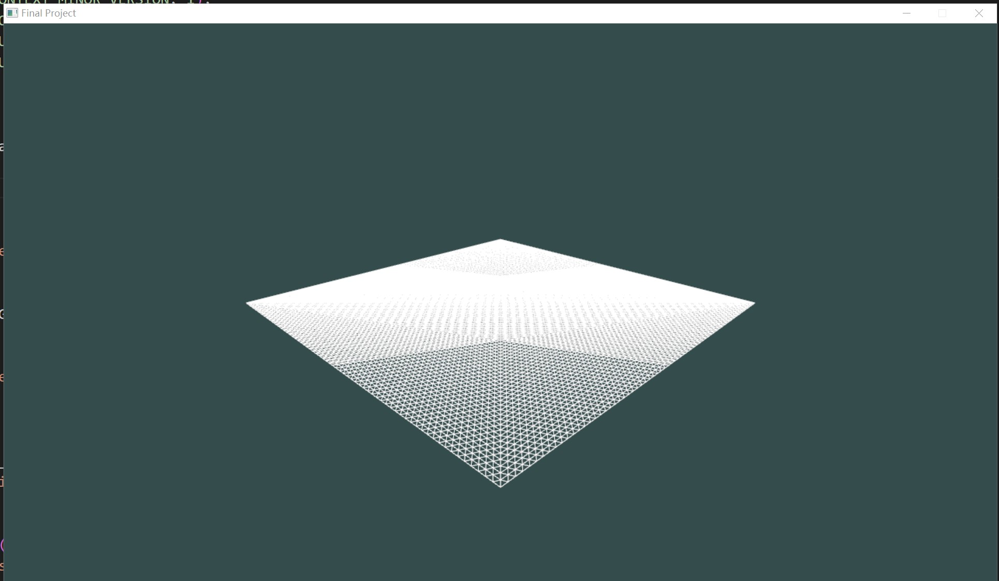
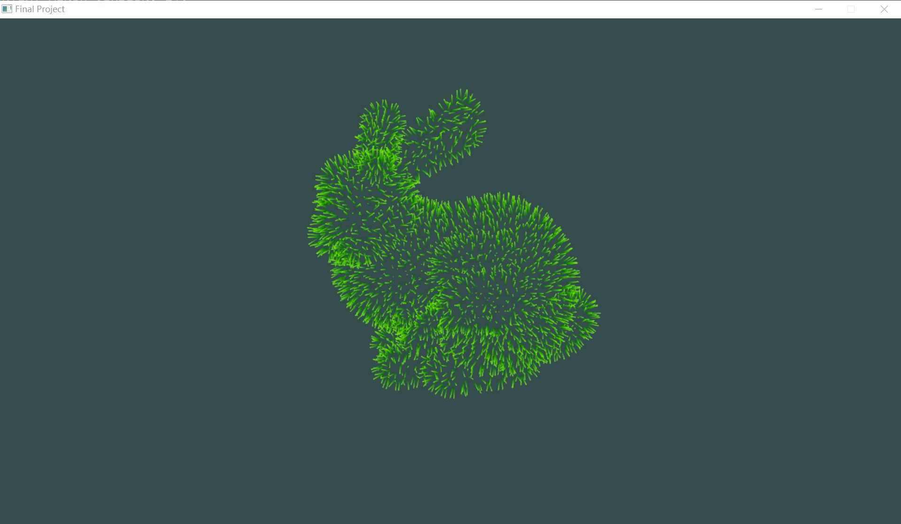
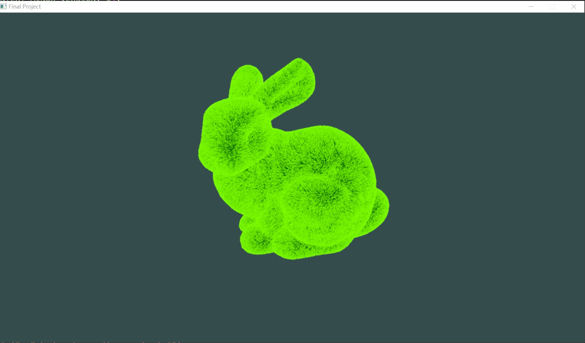
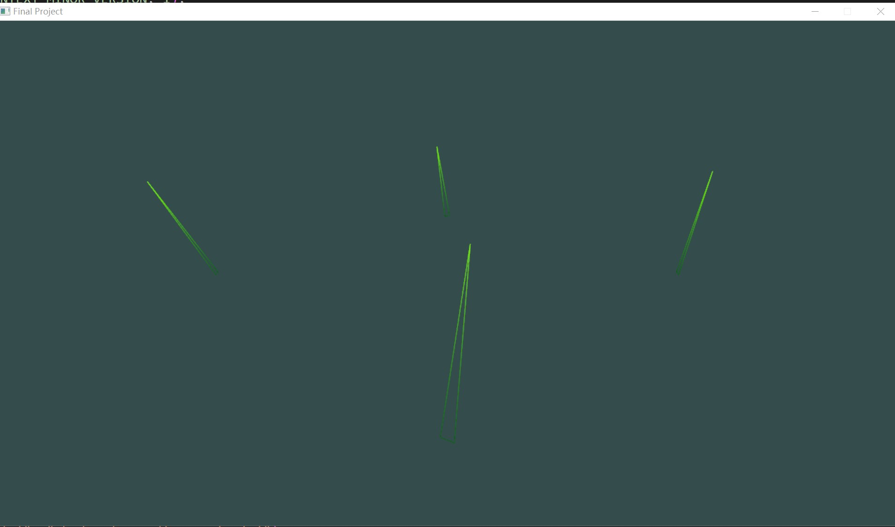
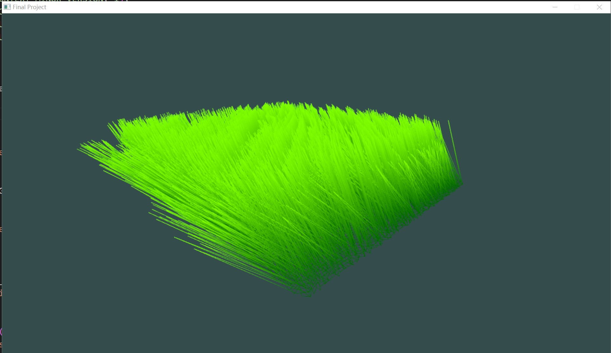

## Grass Rendering Bunny

## Youtube Link: <https://youtu.be/rZwwQ0zcFwY>.

## Project Intro

The programm start with a pure white ground.

You can press "w" into wired mode.

Or you can press "2" into the bunny mode.

Then you can press up-arrow to add more density into it.

* Name and partners name(At most teams of 2 folks total)
  * Team member 1: *Yicheng Jiang*
  * Team member 2: *Cao Hanwen*
* How many hours did it take you to complete this final project? 14
* Did you collaborate or share ideas with any other students/TAs/Professors? No
* Did you use any external resources? 
  * Note it is fair to utilize some tutorials--cite them here. You **must** add your own personal touch however!
  * *<https://roystan.net/articles/grass-shader.html>*
  * *<http://web.engr.oregonstate.edu/~mjb/cs519/Handouts/tessellation.1pp.pdf>*
  * *<http://in2gpu.com/2014/07/12/tessellation-tutorial-opengl-4-3/>*
  * (Optional) What was the most interesting part of the Final Assignment? How could the instructor improve the final project? Maybe more time or demo for finals?

### Rubric

<table>
  <tbody>
    <tr>
      <th>Points</th>
      <th align="center">Description</th>
    </tr>
    <tr>
      <td>(33.3%) Project Completion</td>
     <td align="left"><ul><li>Does the project compile and run.</li><li>Is it polished without any bugs (No weird visual artifacts).</li><li>Did you make a video?</li><li>Did you add a screenshot of your project to the repository?</li></ul></td>
    </tr>
    <tr>
      <td>(33.3%) Technical</td>
      <td align="left"><ul><li>Was the implementation of the project challenging?</li><li>Even if you followed a tutoral, it should not be trivial, and have some personal touch to it.</li><li>Did you have to organize/process a sufficient amount of data?</li><li>Was it clear you consulted some outside resources that go above and beyond the scope of this class</li></ul></td>
    </tr>
    <tr>
      <td>(33.4%) Creativity</td>
      <td align="left"><ul><li>How visually appealing is the scene?<ul><li>Note: There should be some 'wow' factor--instructors discretion is used here.</li></ul></li><li>How original is the project<ul><li>Again, did you enhance a tutorial and do something unique or just go by the book?</li></ul></li></ul></td>
    </tr>
  </tbody>
</table>
